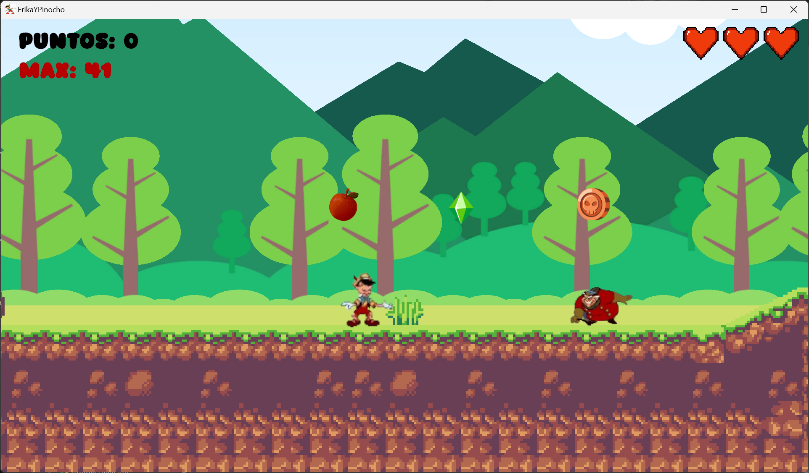

# Programación Multimedia y Dispositivos móviles

## AE-2. Juego en 2D

Actividad Realizada por:

###  Alberto Arroyo Santofimia

El juego consiste en conseguir el anillo de la Princesa Erika y llevarlo a su cofre
para poder celebrar el cumpleaños de Erika.

Pinocho tiene animación al moverse, esperar, saltar.

# REQUISITOS DE LA ACTIVIDAD

# Escena inicial de introducción al juego

Se puede elegir dificultad.

# Cambiar todos los sprites y fondos del juego

# Añadir música de fondo

# Añadir diferentes efectos de sonido

Hay sonidos para cada acción, cuando saltas, según el item que cojas, al golpear enemigos, al intentar abrir el cofre y no llevar el anillo, cuando abres el cofre con el anillo ...

# Añadir diferentes tipos de power-ups para recoger. Cada uno con puntuación diferente

Manzana = 1 , Moneda = 2, Diamante = 3

# Añadir vidas

Se pueden tener 3 corazones máximo, habrá corazones repartidos en el escenario, que solo los podremos coger en caso de tener menos de 3

# Diferentes tipos de enemigos que hacen diferente daño

El cochero quitará 1 punto y Gedeón 2

# Guardar la puntuación máxima de una partida a otra

# Escena final de juego para mostrar la puntuación total y la oportunidad de volver a jugar

# Cambiar el icono del juego

# Cambiar el splash por defecto de Unity

## Algunos añadidos de mi juego

# Fondo efecto Parallax

# Animación si pinocho intenta abrir el cofre y no tiene el anillo

# Cuando tienes el anillo y tocas el cofre, aparecen unos globos y se abre el cofre

